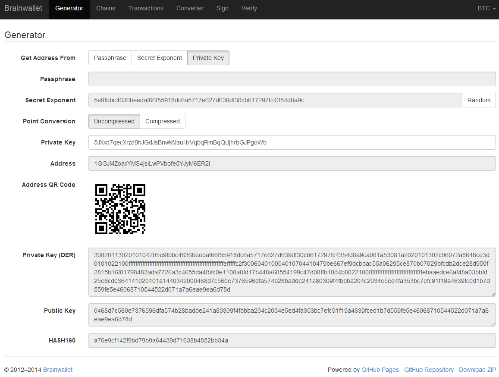

=====
Tools
=====

List of tools included with the installation and how to use them

:ref:`Create Asset Issuance (generateTX50_SP.py) <msc_tx50>`
:ref:`Create Crowdsale (generateTX51_SP.py) <msc_tx51>`
:ref:`Close Crowdsale early (generateTX53_SP.py) <msc_tx53>`
:ref:`Create/Send Tx (msc_createtx.py) <msc_createtx>`

.. _msc_tx50:

generateTX50_SP.py
------------------

Purpose:
^^^^^^^^
`Create a New Smart Property <https://github.com/mastercoin-MSC/spec#new-property-creation-with-fixed-number-of-tokens>`_

Creates the raw transacation that when broadcasts will create a New Smart property.
Located in mastercoin-tools/scripts

Requirements:
^^^^^^^^^^^^^

* Python 2.7.6
* Fully synced Bitcoind node (can be local or remote)
* Private key of the issuing address in bitcoind

Inputs:
^^^^^^^
Takes json input via STDIN for the following variables:

* `transacation_type <https://github.com/mastercoin-MSC/spec#field-transaction-type>`_: type int - representing the tx type (50)
* `ecosystem <https://github.com/mastercoin-MSC/spec#field-ecosystem>`_: type int - 1 For production deployment, 2 for test deployments
* `property_type <https://github.com/mastercoin-MSC/spec#field-property-type>`_: type int - 1 for indivisible currency, 2 for divisible (MSC/TMSC are 2, Maidsafecoins are 1)
* `previous_property_id <https://github.com/mastercoin-MSC/spec#field-property-id>`_: type int - If you are replacing a previous Smart property enter the currency ID here. Otherwise enter 0
* `property_category <https://github.com/mastercoin-MSC/spec#field-string-255-byte-null-terminated>`_: type string - Main category for your property (Suggested :ref:`Categories <categories>`)
* `property_subcategory <https://github.com/mastercoin-MSC/spec#field-string-255-byte-null-terminated>`_: type string - Sub category for your property (See listing on category)
* `property_name <https://github.com/mastercoin-MSC/spec#field-string-255-byte-null-terminated>`_: type string - Name of your Coin/Token/Property
* `property_url <https://github.com/mastercoin-MSC/spec#field-string-255-byte-null-terminated>`_: type string -  Short url users can go to for more information about the Coin/Token/Property you are creating.
* `property_data <https://github.com/mastercoin-MSC/spec#field-string-255-byte-null-terminated>`_: type string - Brief description about what your Coin/Token/Property is for
* `number_properties <https://github.com/mastercoin-MSC/spec#field-number-of-coins>`_: type int - The number of Coins/Tokens/Properties you wish to issue/create. 
* transacation_from: type base58 - Your sending address
* from_private_key: type base58 - Private Key of the sending address ``*``

  * (Note: Should start with the number 5)

The json takes the following format::

        { 
		  "transaction_type": 'type: int, ex: 50',
		  "ecosystem": 'type: int, ex: 1',
		  "property_type": 'type: int, ex: 1',
		  "previous_property_id": 'type: int, ex: 3',
		  "property_category": "type: string, ex: Testing",
		  "property_subcategory": "type: string, ex: Testing Smart Property",
		  "property_name": "type: string, ex: Test Property 1",
		  "property_url": "type: string, ex: mastercoinfoundation.org",
		  "property_data": "type: string, ex: Test Data",
		  "number_properties": 'type: int, ex: 10',
		  "transaction_from": "type: base58",
		  "from_private_key": "type: base58"
	}

Ex:

*Note: for security the following was a brand new empty Address/key. You should replace it's details with your own applicable info*::

		{
			"transaction_type": 50,
			"ecosystem": 2,
			"property_type": 2,
			"previous_property_id": 0,
			"property_category": "Testing",
			"property_subcategory": "Smart Property Test Sequence 1",
			"property_name": "Doubloons",
			"property_url": "http://tinyurl/dubloons",
			"property_data": "Test Issuing a new Currency",
			"number_properties": 1000,
			"transaction_from": "1GGJMZoaxYMS4jsiLwPVbofe5YJyM6ER2i",
			"from_private_key": "5JXxd7qecXrzd9hJGdJsBnwkfJauHxVqbqRmBqQUjhrbGJPgoWb"
		}

For reference, here is what the brainwallet.org generator page for the above address looks like.
Take note of the 'Uncompressed/Compressed' option

Output and Running:
^^^^^^^^^^^^^^^^^^^
You can execute/run the program with::

 cat your_file.json | python generateTX50_SP.py
 
Will return a json formated output.
Errors will be returned with json that contains ::

 {
	"status": "NOT OK", "fix": "bitcoind importprivkey 5JXxd7qecXrzd9hJGdJsBnwkfJauHxVqbqRmBqQUjhrbGJPgoWb imported_1397503463", 
	"error": "Couldn't find address in wallet, please run 'fix' on the machine"
 }
 
In this case you need to import the private key into bitcoind and then run again.

  bitcoind importprivkey 5JXxd7qecXrzd9hJGdJsBnwkfJauHxVqbqRmBqQUjhrbGJPgoWb imported_1397503463 false

Successful run will return json that contains the raw hex::

	{ 
	     "rawtransaction": {
	     "hex": "0100000001e604......90b53ae00000000", 
	     "complete": true
	     }
	}

Once you have the completed successful raw hex send the transaction by copying and pasting that hex string (without its quotes) as an argument to bitcoind sendrawtransaction::

   bitcoind sendrawtransaction 0100000001e604......90b53ae00000000

The output will be the transaction hash ID. Check http://blockchain.info to see the status of the transation. You can also find the transaction via blockchain.info's page for the issuing address.

.. _msc_tx51:

generateTX51_SP.py
------------------

Purpose:
^^^^^^^^
`Create a New Crowdsale <https://github.com/mastercoin-MSC/spec#new-property-creation-via-crowdsale-with-variable-number-of-tokens>`_

Creates the raw transacation that when broadcasts will create a `New Crowdsale <https://github.com/mastercoin-MSC/spec#new-property-creation-via-crowdsale-with-variable-number-of-tokens>`_.
Located in mastercoin-tools/scripts

Requirements:
^^^^^^^^^^^^^

* Python 2.7.6
* Fully synced Bitcoind node (can be local or remote)
* Private key of the issuing address in bitcoind

Inputs:
^^^^^^^
Takes json input via STDIN for the following variables:

* `transacation_type <https://github.com/mastercoin-MSC/spec#field-transaction-type>`_: type int - representing the tx type (51)
* `ecosystem <https://github.com/mastercoin-MSC/spec#field-ecosystem>`_: type int - 1 For production deployment, 2 for test deployments
* `property_type <https://github.com/mastercoin-MSC/spec#field-property-type>`_: type int - 1 for indivisible currency, 2 for divisible (MSC/TMSC are 2, Maidsafecoins are 1)
* `previous_property_id <https://github.com/mastercoin-MSC/spec#field-property-id>`_: type int - If you are replacing a previous Smart property enter the currency ID here. Otherwise enter 0
* `property_category <https://github.com/mastercoin-MSC/spec#field-string-255-byte-null-terminated>`_: type string - Main category for your property (Suggested :ref:`Categories <categories>`)
* `property_subcategory <https://github.com/mastercoin-MSC/spec#field-string-255-byte-null-terminated>`_: type string - Sub category for your property (See listing on category)
* `property_name <https://github.com/mastercoin-MSC/spec#field-string-255-byte-null-terminated>`_: type string - Name of your Coin/Token/Property
* `property_url <https://github.com/mastercoin-MSC/spec#field-string-255-byte-null-terminated>`_: type string -  Short url users can go to for more information about the Coin/Token/Property you are creating.
* `property_data <https://github.com/mastercoin-MSC/spec#field-string-255-byte-null-terminated>`_: type string - Brief description about what your Coin/Token/Property is for
* `currency_identifier <https://github.com/mastercoin-MSC/spec#field-currency-identifier>`_: type int - The currency ID to accept for the crowdsale (what coin investors have to send) ex: 2 (Test MSC)
* `number_properties <https://github.com/mastercoin-MSC/spec#field-number-of-coins>`_: type int - The number of Coins/Tokens/Properties you wish to issue/create.
* `deadline <https://github.com/mastercoin-MSC/spec#field-utc-datetime>`_: type int - Time in UTC the Crowdsale should finish/close/stop.
* `earlybird_bonus <https://github.com/mastercoin-MSC/spec#field-integer-one-byte>`_: type int - Percent extra/week investor gets when investing before the deadline.
* `percentage_for_issuer <https://github.com/mastercoin-MSC/spec#field-integer-one-byte>`_: type int - Percent credited to the issuer for every investment. (You get this percent per token generate for investors)
* transacation_from: type base58 - Your sending address
* from_private_key: type base58 - Private Key of the sending address ``*``

  * (Note: Should start with the number 5)

The json takes the following format::

        { 
		  "transaction_type": 'type: int, ex: 51',
		  "ecosystem": 'type: int, ex: 1',
		  "property_type": 'type: int, ex: 1',
		  "previous_property_id": 'type: int, ex: 3',
		  "property_category": "type: string, ex: Testing",
		  "property_subcategory": "type: string, ex: Testing Smart Property",
		  "property_name": "type: string, ex: Test Property 1",
		  "property_url": "type: string, ex: mastercoinfoundation.org",
		  "property_data": "type: string, ex: Test Data",
		  "currency_identifier_desired": 'type int, ex: 2',
		  "number_properties": 'type: int, ex: 10',
		  "deadline": 'type: int, ex: 7731439200',
		  "earlybird_bonus": 'type: int, ex: 10',
		  "percentage_for_issuer": 'type: int, ex: 12',
		  "transaction_from": "type: base58",
		  "from_private_key": "type: base58"
	}

Ex:

*Note: for security the following was a brand new empty Address/key. You should replace it's details with your own applicable info*::

		{
			"transaction_type": 51,
			"ecosystem": 2,
			"property_type": 2,
			"previous_property_id": 0,
			"property_category": "Testing",
			"property_subcategory": "Smart Property Test Sequence 1",
			"property_name": "Doubloons-Sale",
			"property_url": "http://tinyurl/dubloons",
			"property_data": "Test Issuing a new Currency",
			"currency_identifier_desired": 2,
			"number_properties": 1000,
			"deadline": 1397869200,
			"earlybird_bonus": 0,
			"percentage_for_issuer": 0,
			"transaction_from": "1GGJMZoaxYMS4jsiLwPVbofe5YJyM6ER2i",
			"from_private_key": "5JXxd7qecXrzd9hJGdJsBnwkfJauHxVqbqRmBqQUjhrbGJPgoWb"
		}

For reference, here is what the brainwallet.org generator page for the above address looks like.
Take note of the 'Uncompressed/Compressed' option

Output and Running:
^^^^^^^^^^^^^^^^^^^
You can execute/run the program with::

 cat your_file.json | python generateTX50_SP.py
 
Will return a json formated output.
Errors will be returned with json that contains ::

 {
	"status": "NOT OK", "fix": "bitcoind importprivkey 5JXxd7qecXrzd9hJGdJsBnwkfJauHxVqbqRmBqQUjhrbGJPgoWb imported_1397503463", 
	"error": "Couldn't find address in wallet, please run 'fix' on the machine"
 }
 
In this case you need to import the private key into bitcoind and then run again.

  bitcoind importprivkey 5JXxd7qecXrzd9hJGdJsBnwkfJauHxVqbqRmBqQUjhrbGJPgoWb imported_1397503463 false

Successful run will return json that contains the raw hex::

	{ 
	     "rawtransaction": {
	     "hex": "0100000001e604......90b53ae00000000", 
	     "complete": true
	     }
	}

Once you have the completed successful raw hex send the transaction by copying and pasting that hex string (without its quotes) as an argument to bitcoind sendrawtransaction::

   bitcoind sendrawtransaction 0100000001e604......90b53ae00000000

The output will be the transaction hash ID. Check http://blockchain.info to see the status of the transation. You can also find the transaction via blockchain.info's page for the issuing address.

.. _msc_tx53:

generateTX53_SP.py
------------------

Purpose:
^^^^^^^^
`Close an existing Crowdsale early <https://github.com/mastercoin-MSC/spec#close-a-crowdsale-manually>`_.

Creates the raw transacation that when broadcasts will close the current crowdsale Crowdsale immediately.
Located in mastercoin-tools/scripts

Requirements:
^^^^^^^^^^^^^

* Python 2.7.6
* Fully synced Bitcoind node (can be local or remote)
* Private key of the issuing address in bitcoind

Inputs:
^^^^^^^
Takes json input via STDIN for the following variables:

* `transacation_type <https://github.com/mastercoin-MSC/spec#field-transaction-type>`_: type int - representing the tx type (53)
* `previous_property_id <https://github.com/mastercoin-MSC/spec#field-property-id>`_: type int - If you are replacing a previous Smart property enter the currency ID here. Otherwise enter 0
* transacation_from: type base58 - Your sending address
* from_private_key: type base58 - Private Key of the sending address ``*``

  * (Note: Should start with the number 5)

The json takes the following format::

        { 
		  "transaction_type": 'type: int, ex: 53',
		  "property_type": 'type: int, ex: 1',
		  "transaction_from": "type: base58",
		  "from_private_key": "type: base58"
	}

Ex:

*Note: for security the following was a brand new empty Address/key. You should replace it's details with your own applicable info*::

		{
			"transaction_type": 53,
			"property_type": 4,
			"transaction_from": "1GGJMZoaxYMS4jsiLwPVbofe5YJyM6ER2i",
			"from_private_key": "5JXxd7qecXrzd9hJGdJsBnwkfJauHxVqbqRmBqQUjhrbGJPgoWb"
		}

For reference, here is what the brainwallet.org generator page for the above address looks like.
Take note of the 'Uncompressed/Compressed' option

Output and Running:
^^^^^^^^^^^^^^^^^^^
You can execute/run the program with::

 cat your_file.json | python generateTX53_SP.py
 
Will return a json formated output.
Errors will be returned with json that contains ::

	{
	  "status": "NOT OK", "fix": "bitcoind importprivkey 5JXxd7qecXrzd9hJGdJsBnwkfJauHxVqbqRmBqQUjhrbGJPgoWb imported_1397503463", 
	  "error": "Couldn't find address in wallet, please run 'fix' on the machine"
	}
 
In this case you need to import the private key into bitcoind and then run again.

  bitcoind importprivkey 5JXxd7qecXrzd9hJGdJsBnwkfJauHxVqbqRmBqQUjhrbGJPgoWb imported_1397503463 false

Successful run will return json that contains the raw hex::

	{ 
	    "rawtransaction": {
	    "hex": "0100000001e604......90b53ae00000000", 
	    "complete": true
	     }
	}

Once you have the completed successful raw hex send the transaction by copying and pasting that hex string (without its quotes) as an argument to bitcoind sendrawtransaction::

   bitcoind sendrawtransaction 0100000001e604......90b53ae00000000

The output will be the transaction hash ID. Check http://blockchain.info to see the status of the transation. You can also find the transaction via blockchain.info's page for the issuing address.

.. _msc_createtx:

msc_createtx.py
---------------

Purpose:
^^^^^^^^
Used to create, sign and/or send a Masterprotocol currency transaction.
Located in mastercoin-tools/scripts

Checks:
^^^^^^^

Checks from address to make sure it has:

* Enough BTC to create/send the transaction

  * Note: To avoid potential double spends all unspent TX used to create a new TX are tracked/locked for 10 Blocks from use. It is recommended, when offline signing, to make sure you broadcast within this timeframe.

* Balance of the CurrencyID to make sure it has enough to send msc_send_amt

  * Balance is checked using 2 online resources (Masterchest.info and Omniwallet)

Inputs:
^^^^^^^
Takes json input via STDIN for the following variables:

* transaction_from: The Public Address of the Sender
* transaction_to: The Public address of the Receipiant
* currency_id: Currency ID to send. 1 for MSC, 2 for TMSC
* property_type: 1 for indivisible currency, 2 for divisible (MSC/TMSC are 2, Maidsafecoins are 1)
* send_amt: The amount of the Currency ID to send
* from_private_key: Base58 Private Key of the sender's Public Address ``*``

  * (Note: Should start with the number 5)

* broadcast: Create, Sign and/or Broadcast Tx.

  * 0 - Create the Unsigned TX file only
  * 1 - Create and Sign the TX file 
  * 2 - Create, Sign and Broadcast the TX file

* clean: Clean up any of the tx files created.``*``

  * 0 - Keep all Tx files created
  * 1 - Remove only the intersigned Tx files. (Leaves the original unsigned Tx and the signed Tx)
  * 2 - Remove all unsigned Tx files. Leaves only the signed Tx file that can be broadcast.
  * 3 - Remove all Tx files. Signed and unsigned, make sure you have broadcast the Tx before you do this.

* ``*`` Only required if you are signing/broadcasting the tx file and can be omitted if just creating unsigned file.*

The json takes the following format::

        {
          "transaction_from": "{{Public from Address}}",
          "transaction_to": "{{Public to Address}}",
          "currency_id": {{1 for MSC, 2 for TMSC}},
          "send_amt": {{amount to send}},
          "property_type": {{1 for indivisible currency, 2 for divisible (MSC/TMSC are 2, Maidsafecoins are 1)}}
          "broadcast": {{1 to create and broadcast or 0 to just create}},
          "from_private_key": "{{private key for signing}}",
          "clean": {{0 -keep all tx files, 1 -remove intersigned tx, 2 -remove all unsigned, 3 -remove all}}
        }

Ex:

*Note: for security the following was a brand new empty wallet. You should replace it's details with your own applicable info*::

        {
          "transaction_from": "1GGJMZoaxYMS4jsiLwPVbofe5YJyM6ER2i",
          "transaction_to": "19hf8QEkD3GR7NhUrujWXRg6e4gsHUTysp",
          "currency_id": 1,
          "send_amt": 5.1,
          "property_type": 2,
          "from_private_key": "5JXxd7qecXrzd9hJGdJsBnwkfJauHxVqbqRmBqQUjhrbGJPgoWb",
          "broadcast": 1,
          "clean": 1
        }

For reference, here is what the brainwallet.org generator page for the above address looks like.
Take note of the 'Uncompressed/Compressed' option

Output:
^^^^^^^
Will return a json formated output.
Errors will be returned with json that contains ::

 {
    "status": "Status message",
    "error": "error details",
    "fix": "Corrective action to resolve the issue"
 }

Successful run will return json that contains::

 {
   "status": "Broadcast/Created/Signed status",
   "valid_check": "Validity check of signed file",
   "hash": "Hash of the tx",
   "st_file": "location/name of the signed tx file"
 }

Running:
^^^^^^^^
Standalone running/testing can be done by creating a json file (see input details or example_send.json for structure)
You can execute/run the program with::

 cat your_file.json | python msc_createtx.py

msc-sxsend.py
-------------

Purpose:
^^^^^^^^
DEPRECIATED, Please see :ref:`msc_createtx.py <msc_createtx>`

Used to create (and/or send) a Mastercoin transaction

Checks:
^^^^^^^

Checks from address to make sure it has:

* Enough BTC to create/send the transaction
* Balance of the CurrencyID to make sure it has enough to send msc_send_amt

  * Balance is checked using the :ref:`msc-balance.py <msc-balance>` script

Inputs:
^^^^^^^
Takes json input via STDIN for the following variables:

* transaction_from: The Public Address of the Sender
* transaction_to: The Public address of the Receipiant
* currency_id: Currency ID to send. 1 for MSC, 2 for TMSC
* msc_send_amt: The amount of the Currency ID to send
* property_type: 1 for indivisible currency, 2 for divisible (MSC/TMSC are 2, Maidsafecoins are 1)
* from_private_key: Base58 Private Key of the sender's Public Address (Note: Should start with 5)
* broadcast: Create and/or Broadcast Tx. 1 to create and broadcast or 0 to just create
* clean: Clean up any of the tx files created.

  * 0 - Keep all Tx files created
  * 1 - Remove only the intersigned Tx files. (Leaves the original unsigned Tx and the signed Tx)
  * 2 - Remove all unsigned Tx files. Will leave only the signed Tx file that can be broadcast to the network. 
  * 3 - Remove all Tx files. Signed and unsigned, make sure you have broadcast the Tx before you do this.

The json takes the following format::

	{
	  "transaction_from": "{{Public from Address}}",
	  "transaction_to": "{{Public to Address}}",
	  "currency_id": {{1 for MSC, 2 for TMSC}},
	  "msc_send_amt": {{amount to send}},
	  "property_type": {{1 for indivisible currency, 2 for divisible (MSC/TMSC are 2, Maidsafecoins are 1)}}
	  "from_private_key": "{{private key for signing}}",
	  "broadcast": {{1 to create and broadcast or 0 to just create}},
          "clean": {{0 -keep all tx files, 1 -remove intersigned tx, 2 -remove all unsigned, 3 -remove all}}
	}

Ex:

*Note: for security the following was a brand new empty wallet. You should replace it's details with your own applicable info*::

	{
	  "transaction_from": "1GGJMZoaxYMS4jsiLwPVbofe5YJyM6ER2i",
	  "transaction_to": "19hf8QEkD3GR7NhUrujWXRg6e4gsHUTysp",
	  "currency_id": 1,
	  "msc_send_amt": 5.1,
	  "property_type": 2,
	  "from_private_key": "5JXxd7qecXrzd9hJGdJsBnwkfJauHxVqbqRmBqQUjhrbGJPgoWb",
	  "broadcast": 1,
          "clean": 1
	}

For reference, here is what the brainwallet.org generator page for the above address looks like.
Take note of the 'Uncompressed/Compressed' option 

Output:
^^^^^^^
Will return a json formated output.
Errors will be returned with json that contains ::

 { 
    "status": "Status message", 
    "error": "error details", 
    "fix": "Corrective action to resolve the issue"
 }

Successful run will return json that contains::

 { 
   "status": "Broadcast/Created status", 
   "valid_check": "Validity check of signed file", 
   "hash": "Hash of the tx", 
   "st_file": "location/name of the signed tx file"
 }

Running:
^^^^^^^^
Standalone running/testing can be done by creating a json file (see input details or example_send.json for structure)
You can execute/run the program with::

 cat your_file.json | python msc_sxsend.py

msc-txcreate.py
---------------

Purpose:
^^^^^^^^
DEPRECIATED, Please see :ref:`msc_createtx.py <msc_createtx>`

Used to create an unsigned Mastercoin transaction

Checks:
^^^^^^^

Checks from address to make sure it has:

* Enough BTC to create/send the transaction
* Balance of the CurrencyID to make sure it has enough to send msc_send_amt

  * Balance is checked using the :ref:`msc-balance.py <msc-balance>` script

Inputs:
^^^^^^^
Takes json input via STDIN for the following variables:

* transaction_from: The Public Address of the Sender
* transaction_to: The Public address of the Receipiant
* currency_id: Currency ID to send. 1 for MSC, 2 for TMSC
* msc_send_amt: The amount of the Currency ID to send
* property_type: 1 for indivisible currency, 2 for divisible (MSC/TMSC are 2, Maidsafecoins are 1)

The json takes the following format::

        {
          "transaction_from": "{{Public from Address}}",
          "transaction_to": "{{Public to Address}}",
          "currency_id": {{1 for MSC, 2 for TMSC}},
          "msc_send_amt": {{amount to send}},
	  "property_type": {{1 for indivisible currency, 2 for divisible (MSC/TMSC are 2, Maidsafecoins are 1)}}
        }

Ex:

*Note: for security the following was a brand new empty wallet. You should replace it's details with your own applicable info*::

        {
          "transaction_from": "1GGJMZoaxYMS4jsiLwPVbofe5YJyM6ER2i",
          "transaction_to": "19hf8QEkD3GR7NhUrujWXRg6e4gsHUTysp",
          "currency_id": 1,
          "msc_send_amt": 5.1
        }

Output:
^^^^^^^
Will return a json formated output.
Errors will be returned with json that contains ::

 {
    "status": "Status message",
    "error": "error details",
    "fix": "Corrective action to resolve the issue"
 }

Successful run will return json that contains::

 {
   "status": "Created status",
   "st_file": "location/name of the unsigned tx file"
 }

Running:
^^^^^^^^
Standalone running/testing can be done by creating a json file (see input details or example_send.json for structure)
You can execute/run the program with::

 cat your_file.json | python msc-txcreate.py

.. _msc-balance:

msc-balance.py
--------------

Purpose:
^^^^^^^^
Used to get the Mastercoin balance of an address

Requirements:
^^^^^^^^^^^^^
This script leverages the existing mastercoin tools parsed/validated output.
Mastercoin tools should be installed and fully updated with the Mastercoin Data in::

 /var/lib/mastercoin-tools/mastercoin_verify/addresses/

Checks:
^^^^^^^

Will check/return the date of the parsed date as listed in ::

 /var/lib/mastercoin-tools/www/revision.json

Inputs:
^^^^^^^
Takes json input via STDIN for the following variables:

* address: The address you want to check the balance for
* currency_id: The currency you want the balance for

  * 1 - Mastercoin
  * 2 - Test Mastercoins

The json takes the following format::

        {
          "address": "{{Address to check}}",
          "currency_id": {{1 for MSC, 2 for TMSC}}
        }

Ex: ::

        {
          "address": "1CMauYumpA7YG8i4cPod8FadRLK95HxSob",
          "currency_id": 1
	}

Output:
^^^^^^^
Will return a json formated output

Completed run will return json that contains::

 { 
   "address": "Address checked",
   "currency_id": "Currency checked",
   "balance": "Balance or error message",
   "balancetime": "Time in GMT human readable",
   "epochtime": "Balance Timestamp in GMT epoch"
 }

*Note: If the revision file or currency address files are missing the time is omitted and an error message is returned for balance.*

Running:
^^^^^^^^
Standalone running/testing can be done by creating a json file (see input details or example_balance.json for structure)
You can execute/run the program with::

 cat your_file.json | python msc-balance.py

getConsensusMSC.py
------------------

Purpose:
^^^^^^^^
Used to get the consensus of local installation with Online sites
*Note: The final consensus authority is defined by the mastercoin tools code result.*
`Masterchain Consensus Report <https://masterchain.info/general/MSC-difference.txt>`_

Requirements:
^^^^^^^^^^^^^
This script leverages the existing mastercoin tools parsed/validated output.
Mastercoin tools should be installed and fully updated with the Mastercoin Data in::

 /var/lib/mastercoin-tools/mastercoin_verify/addresses/

Inputs:
^^^^^^^
Takes json input via STDIN for the sites you wish to validate consensus against:
*Note: At present generates consensus output for Currency ID 1 (MSC) only.* 

* site: The sites to compare local results against

The json takes the following format::

	{ "sites":
	    [
       	      "http://masterchain.info/mastercoin_verify/addresses/0",
	      "https://masterchest.info/mastercoin_verify/addresses.aspx",
              "http://mymastercoins.com/jaddress.aspx"
	    ]
	}

Output:
^^^^^^^
Will return a json formated output array of address not in consensus

For each address not in Consensus, completed run will return balance of that address for each site checked in json format::

 {
   "consensus": Number Representing Consensus Rating,
   "data":[
      [
         {
            "balance": Number Representing Current balance for the site checked,
            "site":"Site/Data Source name",
            "address":"address not in consensus"
         },
	 {
	   ... data in format of ^ for each site when address is not in consensus
	 }
      ],
      [
         ... 2nd address (if exists) not in consensus in format ^^^
      ]
   ]
 }

Running:
^^^^^^^^
Running by creating a json file (see input details) for sites you wish to check or use the provided getConsensus.json
You can execute/run the program with::

 cat getConsensus.json | python getConsensusMSC.py

